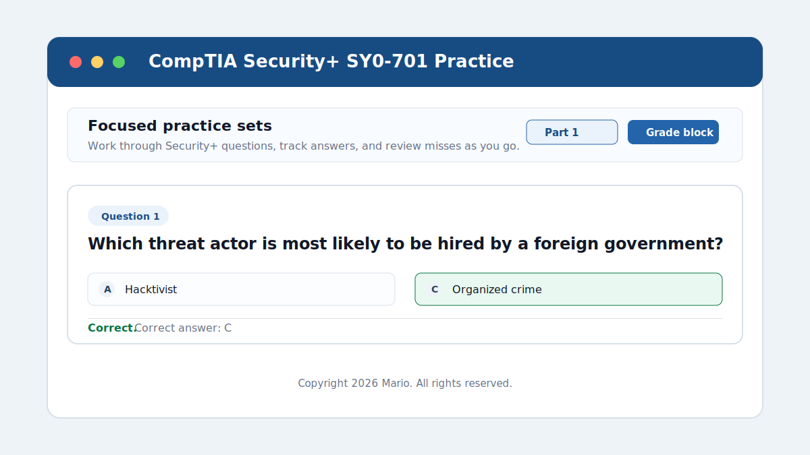
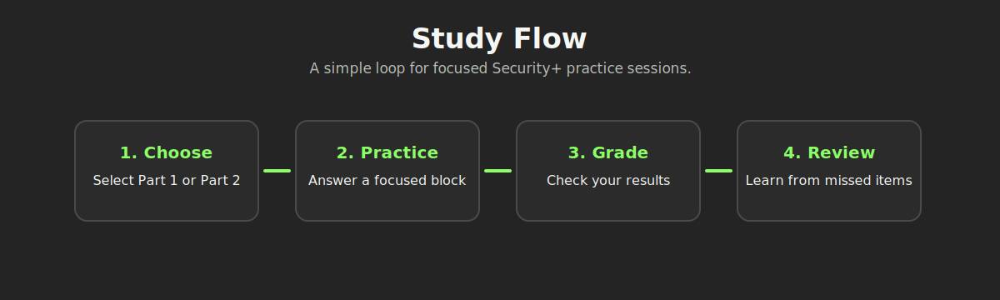

# CompTIA Security+ SY0-701 Practice



A lightweight HTML practice app for studying CompTIA Security+ SY0-701 questions in focused blocks. The project runs entirely in the browser, so it can be opened locally or hosted with GitHub Pages.

## Live Demo

The project is available at:

```text
https://mabarajam.github.io/CompTIASecurity-Practice/
```

## Features

- Practice questions organized by SY0-701 parts.
- Focused question blocks for shorter study sessions.
- Single answer and multiple answer question support.
- Instant grading for the current block.
- Show or hide correct answers while reviewing.
- Light and dark theme toggle.
- Local browser progress storage.
- Fully self-contained `index.html` file.

## Walkthrough

### 1. Choose a Practice Part

Use the part selector at the top of the page to switch between available question sets. Each part shows its own progress and question count.

### 2. Work Through a Question Block

Questions are grouped into smaller blocks so studying feels more manageable. Select an answer for each question before grading the block.

### 3. Grade Your Answers

Click **Grade block** to check your responses. Correct answers are highlighted, and missed questions are marked for review.

### 4. Review and Repeat

Use **Show answers** when you want to study the correct responses directly. Use **Previous** and **Next** to move between blocks.



## How to Use Locally

Download or clone the repository, then open `index.html` in your browser.
No installation, build tools, or server setup are required.


## Project Structure

```text
.
├── index.html
├── README.md
└── assets
    ├── project-preview.svg
    └── study-flow.svg
```

## Notes

This project is intended as a personal study tool for Security+ practice. CompTIA and Security+ are trademarks of CompTIA. This project is not affiliated with or endorsed by CompTIA.
